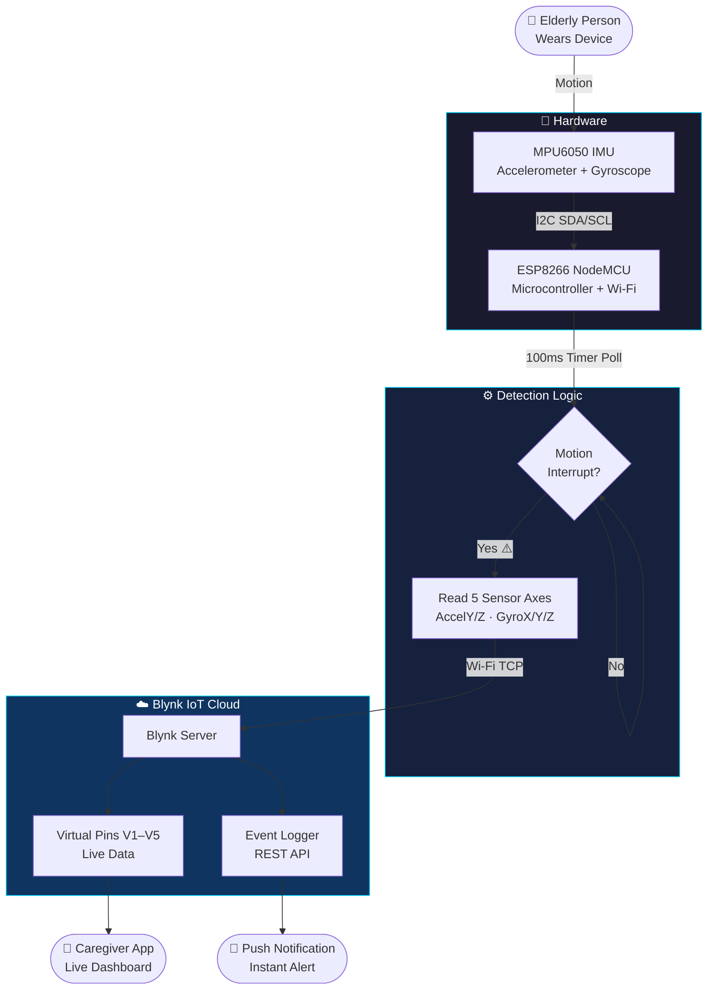
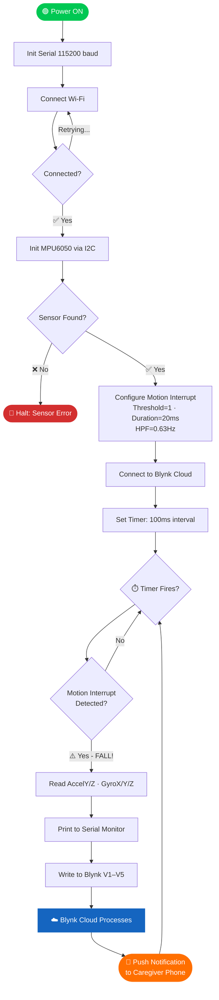

<div align="center">


[](https://git.io/typing-svg)

<br/>


[](https://www.arduino.cc/)
[](https://blynk.io/)
[](https://invensense.tdk.com/)

<br/>

</div>

---

## 📌 About The Project

<table>
<tr>
<td width="100%">

Falls are the **#1 cause of injury** among elderly adults — and delayed response makes outcomes far worse. This project tackles that with a compact, low-cost IoT device.

The **Elderly Fall Detection System** straps onto the elderly person and uses the **MPU6050 IMU sensor** to track 6-axis motion data 10 times per second. When a sudden fall-like jolt is detected via a hardware motion interrupt, it instantly sends the sensor readings to the **Blynk IoT cloud** and pushes a **real-time alert** to the caregiver's smartphone.

**No manual reporting. No delays. Just instant protection.**

### 🎯 Objectives
- Monitor real-time acceleration and angular velocity
- Detect abnormal motion patterns that indicate a fall
- Alert caregivers immediately via smartphone notifications
- Keep hardware simple, affordable, and wearable

</td>

<br/><br/>

</td>
</tr>
</table>

---


## ✨ Features

<div align="center">

| Feature | Description |
|:---:|:---|
| ⚡ **Real-Time Detection** | MPU6050 hardware interrupt fires within milliseconds of a fall |
| 📡 **Blynk IoT Cloud** | Live sensor data streamed to cloud via Wi-Fi every 100ms |
| 🔔 **Push Notifications** | Instant alert delivered to caregiver's phone via Blynk app |
| 📊 **Live Dashboard** | 5 sensor channels visualized live on the Blynk mobile dashboard |
| 🧠 **Smart Filtering** | 0.63 Hz high-pass filter removes gravity drift; only real motion triggers |
| 🔋 **Interrupt-Driven** | Hardware interrupt architecture — no wasted CPU cycles during inactivity |
| 🔧 **Configurable** | Adjustable motion threshold (default: `1`) and duration (default: `20ms`) |
| 📶 **Auto Reconnect** | Robust Wi-Fi + Blynk reconnection with serial diagnostics |

</div>

---


## 🏗️ System Architecture



---


## 🔧 Hardware Components

<div align="center">


</div>

| # | Component | Purpose | Qty |
|:---:|:---|:---|:---:|
| 1 | **ESP8266 NodeMCU v1.0** | Main processor + Wi-Fi module | 1 |
| 2 | **MPU6050 GY-521** | 3-axis Accelerometer + 3-axis Gyroscope | 1 |
| 3 | **Breadboard** | Prototyping base | 1 |
| 4 | **Jumper Wires (M-M)** | GPIO connections | ~10 |
| 5 | **USB Micro-A Cable** | Programming & power supply | 1 |
| 6 | **5V Power Bank** | Portable power for wearable use | 1 |

<div align="center">

</div>

---


## 🔌 Circuit Connections

```
ESP8266 NodeMCU              MPU6050 (GY-521)
┌─────────────────┐          ┌──────────────────┐
│   3.3V  ────────┼──────────┼── VCC            │
│   GND   ────────┼──────────┼── GND            │
│ D2/GPIO4 ───────┼──────────┼── SDA  (I2C Data)│
│ D1/GPIO5 ───────┼──────────┼── SCL  (I2C CLK) │
│                 │          │   AD0 ─── GND    │
└─────────────────┘          └──────────────────┘
```

| MPU6050 Pin | ESP8266 Pin | Notes |
|:---:|:---:|:---|
| VCC | 3.3V | ⚠️ Do NOT use 5V — will damage sensor |
| GND | GND | Common ground |
| SDA | D2 (GPIO4) | I2C Data line |
| SCL | D1 (GPIO5) | I2C Clock line |
| AD0 | GND | Sets I2C address to `0x68` |

---


## 💻 Software & Libraries

**IDE:** Arduino IDE 2.x + ESP8266 Board Package

| Library | Purpose | Install Via |
|:---|:---|:---|
| `ESP8266WiFi.h` | Wi-Fi stack for NodeMCU | Board package (built-in) |
| `BlynkSimpleEsp8266.h` | Blynk cloud integration | Library Manager → *Blynk* |
| `Adafruit_MPU6050.h` | MPU6050 IMU sensor driver | Library Manager → *Adafruit MPU6050* |
| `Adafruit_Sensor.h` | Unified sensor abstraction | Library Manager → *Adafruit Unified Sensor* |
| `Wire.h` | I2C communication | Built-in |

---


## ⚙️ How It Works

<div align="center">

</div>

### Step-by-Step Operation

**1. Boot & Connect**
ESP8266 connects to Wi-Fi (`Amit1`) and initializes MPU6050 over I2C. Serial monitor confirms both connections at 115200 baud.

**2. Motion Detection Setup**
MPU6050 is configured with:
- 🔹 High-pass filter: `0.63 Hz` — removes gravity drift, captures only sudden movements
- 🔹 Threshold: `1` — sensitivity level for motion detection
- 🔹 Duration: `20 ms` — motion must last 20ms (eliminates vibration noise)
- 🔹 Latch mode: `true` — interrupt stays active until explicitly cleared

**3. Timer-Based Polling**
`BlynkTimer` triggers `sendSensor()` every **100ms** — non-blocking, so Blynk stays connected.

**4. Fall Detection**
Inside `sendSensor()`, the MPU6050's interrupt flag is checked. If raised:
- All 5 axes are read: `AccelY`, `AccelZ`, `GyroX`, `GyroY`, `GyroZ`
- Data is logged to Serial Monitor
- Values pushed to Blynk virtual pins **V1–V5**

**5. Cloud Alert**
Blynk receives the data spike and notifies the caregiver's app instantly.

### Virtual Pin Mapping

| Virtual Pin | Sensor Value | Unit | What It Tells Us |
|:---:|:---:|:---:|:---|
| V1 | AccelY | m/s² | Forward/backward tilt |
| V2 | AccelZ | m/s² | Vertical impact (key fall indicator) |
| V3 | GyroX | rad/s | Roll rate |
| V4 | GyroY | rad/s | Pitch rate |
| V5 | GyroZ | rad/s | Yaw rate |

---

## 🔄 Project Workflow



---

## 🚀 Setup Guide

**1. Install ESP8266 board in Arduino IDE**
> File → Preferences → Additional Board URLs:
```
https://dl.espressif.com/dl/package_esp32_index.json
```
Then: Tools → Board Manager → search `ESP8266` → Install

**2. Install required libraries** via Tools → Manage Libraries:
```
Blynk · Adafruit MPU6050 · Adafruit Unified Sensor
```

**3. Create a Blynk Template** at [blynk.cloud](https://blynk.cloud)
- Add 5 datastreams: V1–V5 (type: Double)
- Copy your Template ID, Template Name, and Auth Token

**4. Update credentials in the `.ino` file:**
```cpp
#define BLYNK_TEMPLATE_ID   "YOUR_TEMPLATE_ID"
#define BLYNK_TEMPLATE_NAME "YOUR_TEMPLATE_NAME"
#define BLYNK_AUTH_TOKEN    "YOUR_AUTH_TOKEN"

char ssid[] = "YOUR_WIFI_NAME";
char pass[] = "YOUR_WIFI_PASSWORD";
```

**5. Upload & Verify**
- Board: `NodeMCU 1.0 (ESP-12E Module)`
- Serial Monitor: `115200 baud`
- Expected output:
```
Connecting to YourWiFi
..........WiFi connected
MPU6050 Found!
AccelY:0.12, AccelZ:-9.78, GyroX:0.01, GyroY:0.02, GyroZ:-0.01
```

---

## 📸 Demo & Output

<div align="center">

| Circuit Setup | Blynk Dashboard |
|:---:|:---:|
|  |  |
| *ESP8266 + MPU6050 wired on breadboard* | *Live sensor readings on Blynk app* |

| Fall Alert Notification | Serial Monitor Output |
|:---:|:---:|
|  |  |
| *Push notification triggered on caregiver phone* | *115200 baud serial data stream* |

> 📷 Replace image paths with your actual project photos.

<br/>


</div>

---

## 🚀 Future Enhancements

| Enhancement | Description |
|:---|:---|
| 🤖 **AI Fall Prediction** | TensorFlow Lite model on-device to predict falls before they happen |
| 📱 **Custom Mobile App** | Flutter/React Native app with SOS button and caregiver management |
| 🗺️ **GPS Tracking** | NEO-6M GPS module for real-time location during fall events |
| ❤️ **Vitals Monitoring** | MAX30102 for heart rate + SpO2 alongside motion detection |
| ☁️ **Analytics Dashboard** | Web dashboard with fall history, frequency charts, and health trends |
| ⌚ **Wearable PCB** | Custom PCB + 3D-printed enclosure for a wristband form factor |

---


<div align="center">


⭐ **If this project helped you, please give it a star!** ⭐

</div>
