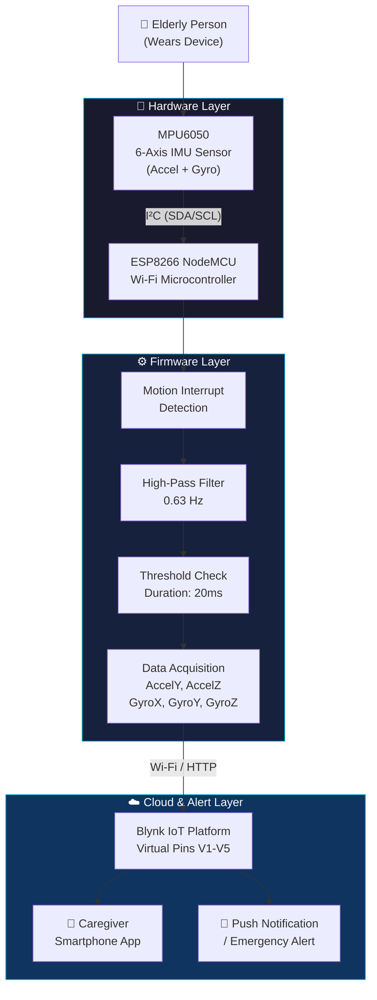
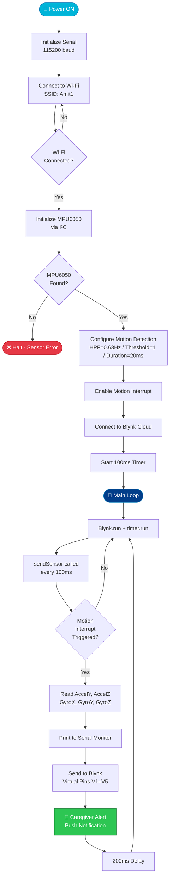

<div align="center">

<!-- Animated Typing Banner -->
<a href="https://git.io/typing-svg"></a>

<br/>

# 🏥 Elderly Fall Detection System

### *Smart IoT-powered real-time fall monitoring and instant caregiver alerting for elderly individuals*

<br/>

<!-- Badges -->


<br/>

<!-- Tech Logos -->
<p>
  
  &nbsp;&nbsp;
  
  &nbsp;&nbsp;
  
</p>

<br/>

---

</div>

## 📋 Table of Contents

- [🔍 Project Overview](#-project-overview)
- [✨ Key Features](#-key-features)
- [🏗️ System Architecture](#-system-architecture)
- [🔧 Hardware Components](#-hardware-components)
- [💻 Software & Libraries](#-software--libraries)
- [⚙️ Working Principle](#-working-principle)
- [🔌 Circuit Connections](#-circuit-connections)
- [🚀 Installation & Setup](#-installation--setup)
- [📁 Code Structure](#-code-structure)
- [🔄 Project Workflow](#-project-workflow)
- [📸 Results & Demonstration](#-results--demonstration)
- [🌍 Applications](#-applications)
- [🚀 Future Enhancements](#-future-enhancements)
- [📂 Folder Structure](#-folder-structure)
- [👤 Author](#-author)
- [📄 License](#-license)

---

## 🔍 Project Overview

<div align="center">

> *"Every 11 seconds, an older adult is treated in an emergency room for a fall. Falls are the leading cause of fatal and non-fatal injuries in people over 65."*
> — **Centers for Disease Control and Prevention (CDC)**

</div>

### 🚨 The Problem

Falls among elderly individuals are a **critical global health challenge**:

- 🏥 Falls account for **over 684,000 deaths annually** worldwide (WHO)
- ⏰ Delayed assistance after a fall dramatically increases injury severity
- 😟 Many elderly people live alone with **no immediate help nearby**
- 💸 Fall-related injuries cost healthcare systems **billions annually**
- 😰 Fear of falling reduces independence and quality of life

### 💡 The Solution

The **Elderly Fall Detection System** is a compact, low-cost IoT device worn on the body that:

1. **Continuously monitors** body orientation, acceleration, and angular velocity using the **MPU6050 (6-axis IMU)**
2. **Detects fall events** in real-time using motion interrupt thresholds and high-pass filtering
3. **Instantly pushes alerts** to caregivers via the **Blynk IoT platform** over Wi-Fi
4. **Streams live sensor data** (AccelY, AccelZ, GyroX, GyroY, GyroZ) to the Blynk dashboard
5. Operates on the **ESP8266 Wi-Fi microcontroller** — lightweight, power-efficient, and affordable

---

## ✨ Key Features

| Feature | Description |
|---|---|
| 🎯 **Real-Time Fall Detection** | Motion interrupt-triggered detection using MPU6050 hardware interrupt |
| 📡 **Wi-Fi Connectivity** | Seamless data transmission via ESP8266's built-in Wi-Fi module |
| 📊 **Live Sensor Dashboard** | AccelY, AccelZ, GyroX, GyroY, GyroZ streamed to Blynk virtual pins |
| 🔔 **Instant Caregiver Alerts** | Push notifications sent immediately upon fall detection |
| 🔬 **6-Axis IMU Sensing** | 3-axis accelerometer + 3-axis gyroscope for precise motion analysis |
| ⚡ **High-Pass Filter DSP** | 0.63 Hz high-pass filter removes gravity bias for accurate fall discrimination |
| 🛡️ **Configurable Thresholds** | Motion detection threshold and duration are software-configurable |
| 💰 **Low-Cost Implementation** | Built with off-the-shelf components totaling under ₹500 / $6 USD |
| 🌐 **Cloud IoT Integration** | Data logged and visualised on Blynk cloud platform |
| 🔄 **100ms Polling Rate** | Timer-based sensor polling at 100 ms intervals for responsiveness |

---

## 🏗️ System Architecture



---

## 🔧 Hardware Components

| # | Component | Model | Purpose |
|---|-----------|-------|---------|
| 1 | **Microcontroller** | ESP8266 NodeMCU | Main processing unit + Wi-Fi communication |
| 2 | **IMU Sensor** | MPU6050 | 3-axis accelerometer + 3-axis gyroscope for fall sensing |
| 3 | **Prototyping Board** | Breadboard | Circuit assembly without soldering |
| 4 | **Connecting Wires** | Male-to-Male Jumper Wires | Electrical connections between components |
| 5 | **Power Supply** | USB Type-A Connector | Power delivery to ESP8266 via USB |
| 6 | **Development IDE** | Arduino IDE | Code compilation and flashing |
| 7 | **IoT Platform** | Blynk | Dashboard, alerts, and data visualization |

### 🖼️ Component Highlights

<details>
<summary>📦 ESP8266 NodeMCU</summary>

- **Processor:** 80 MHz Tensilica L106 RISC
- **Flash:** 4 MB
- **Wi-Fi:** 802.11 b/g/n
- **GPIO Pins:** 17 (11 usable)
- **I²C Support:** Yes (D1=SCL, D2=SDA)
- **Operating Voltage:** 3.3V
- **Cost:** ~₹150

</details>

<details>
<summary>📦 MPU6050 (6-Axis IMU)</summary>

- **Accelerometer Range:** ±2g / ±4g / ±8g / ±16g
- **Gyroscope Range:** ±250 / ±500 / ±1000 / ±2000 °/s
- **Interface:** I²C (up to 400 kHz)
- **Motion Interrupt:** Hardware interrupt for fall/motion events
- **High-Pass Filter:** Configurable (0.63 Hz used in this project)
- **Operating Voltage:** 3.3V–5V
- **Cost:** ~₹120

</details>

---

## 💻 Software & Libraries

### 🛠️ Development Environment

| Tool | Version | Purpose |
|------|---------|---------|
| **Arduino IDE** | ≥ 1.8.x | Code editing, compilation & flashing |
| **ESP8266 Board Package** | Latest | ESP8266 core support |
| **Blynk Library** | ≥ 1.0.0 | IoT platform integration |
| **Adafruit MPU6050** | ≥ 2.2.x | MPU6050 sensor abstraction |
| **Adafruit Unified Sensor** | ≥ 1.1.x | Sensor event abstraction layer |
| **Wire (Built-in)** | Built-in | I²C communication |
| **ESP8266WiFi (Built-in)** | Built-in | Wi-Fi connectivity |

### 📦 Library Dependencies

```cpp
#include <ESP8266WiFi.h>         // Wi-Fi stack for ESP8266
#include <WiFiClient.h>          // TCP/IP client
#include <BlynkSimpleEsp8266.h>  // Blynk IoT integration
#include <Adafruit_MPU6050.h>    // MPU6050 driver
#include <Adafruit_Sensor.h>     // Unified sensor abstraction
#include <Wire.h>                // I²C protocol
```

### 🌐 Communication Protocol

```
ESP8266  ──[I²C]──>  MPU6050
ESP8266  ──[Wi-Fi / TCP]──>  Blynk Cloud Server
Blynk Cloud  ──[Push Notification]──>  Caregiver Smartphone
```

---

## ⚙️ Working Principle

The system follows a **hardware-interrupt driven** architecture for minimal latency:

```
Step 1: POWER ON
    └── ESP8266 boots → Serial initialized at 115200 baud
    └── Wi-Fi connection established
    └── Blynk cloud connection authenticated

Step 2: MPU6050 INITIALIZATION
    └── I²C communication established with sensor
    └── High-Pass Filter set to 0.63 Hz (removes DC gravity component)
    └── Motion Detection Threshold set to 1 (sensitive)
    └── Motion Detection Duration set to 20 ms
    └── Interrupt pin configured (Latched, Active-High)
    └── Motion Interrupt ENABLED

Step 3: CONTINUOUS MONITORING (Every 100 ms)
    └── BlynkTimer fires → sendSensor() called
    └── Check: mpu.getMotionInterruptStatus() ?
         ├── NO  → Return (no significant motion)
         └── YES → Proceed to Step 4

Step 4: FALL EVENT DETECTED
    └── Read sensor event: acceleration + gyroscope
    └── Log to Serial Monitor (AccelY, AccelZ, GyroX, GyroY, GyroZ)
    └── Push data to Blynk virtual pins:
         ├── V1 ← AccelY (m/s²)
         ├── V2 ← AccelZ (m/s²)
         ├── V3 ← GyroX  (rad/s)
         ├── V4 ← GyroY  (rad/s)
         └── V5 ← GyroZ  (rad/s)

Step 5: CAREGIVER ALERT
    └── Blynk triggers push notification on caregiver's phone
    └── Dashboard updates with real-time sensor readings
    └── 200 ms delay → system resumes monitoring
```

---

## 🔌 Circuit Connections

### I²C Pin Mapping: ESP8266 ↔ MPU6050

| MPU6050 Pin | ESP8266 Pin | NodeMCU Label | Function |
|-------------|-------------|---------------|----------|
| `VCC` | `3V3` | 3.3V | Power Supply |
| `GND` | `GND` | GND | Ground |
| `SCL` | `GPIO5` | D1 | I²C Clock |
| `SDA` | `GPIO4` | D2 | I²C Data |
| `INT` | *(optional)* | — | Hardware Interrupt Pin |
| `AD0` | `GND` | GND | I²C Address = 0x68 |

### Blynk Virtual Pin Mapping

| Blynk Virtual Pin | Sensor Data | Unit |
|-------------------|-------------|------|
| `V1` | Acceleration Y-axis | m/s² |
| `V2` | Acceleration Z-axis | m/s² |
| `V3` | Gyroscope X-axis | rad/s |
| `V4` | Gyroscope Y-axis | rad/s |
| `V5` | Gyroscope Z-axis | rad/s |

---

## 🚀 Installation & Setup

### Step 1: Prerequisites

- ✅ [Arduino IDE](https://www.arduino.cc/en/software) installed
- ✅ [ESP8266 Board Package](https://dl.espressif.com/dl/package_esp32_index.json) added
- ✅ Blynk account created at [blynk.cloud](https://blynk.cloud)

### Step 2: Install Board Support

In Arduino IDE → **File → Preferences → Additional Board Manager URLs**:
```
https://arduino.esp8266.com/stable/package_esp8266com_index.json
```
Then: **Tools → Board → Boards Manager** → Search `ESP8266` → Install

### Step 3: Install Libraries

In Arduino IDE → **Sketch → Include Library → Manage Libraries**:

```
✔ Blynk                  by Volodymyr Shymanskyy
✔ Adafruit MPU6050       by Adafruit
✔ Adafruit Unified Sensor by Adafruit
```

### Step 4: Clone the Repository

```bash
git clone https://github.com/YOUR_USERNAME/elderly-fall-detection.git
cd elderly-fall-detection
```

### Step 5: Configure Credentials

Open `final_iot.ino` and update these fields:

```cpp
// ── Blynk Configuration ──────────────────────────────────
#define BLYNK_TEMPLATE_ID   "YOUR_TEMPLATE_ID"
#define BLYNK_TEMPLATE_NAME "Elderly Fall System"
#define BLYNK_AUTH_TOKEN    "YOUR_AUTH_TOKEN"

// ── Wi-Fi Credentials ────────────────────────────────────
char ssid[] = "YOUR_WIFI_SSID";
char pass[] = "YOUR_WIFI_PASSWORD";
```

### Step 6: Configure Blynk Dashboard

In the Blynk app, create **5 Gauge / Graph widgets** mapped to:

| Widget | Virtual Pin | Label |
|--------|-------------|-------|
| Gauge | V1 | Accel Y |
| Gauge | V2 | Accel Z |
| Gauge | V3 | Gyro X |
| Gauge | V4 | Gyro Y |
| Gauge | V5 | Gyro Z |

### Step 7: Flash the Code

1. Connect ESP8266 via USB
2. Select Board: **Tools → Board → NodeMCU 1.0 (ESP-12E Module)**
3. Select Port: **Tools → Port → COMx**
4. Click **Upload** (Ctrl+U)
5. Open **Serial Monitor** at `115200 baud` to verify

---

## 📁 Code Structure

```
final_iot.ino
├── [Preprocessor Defines]
│   ├── BLYNK_TEMPLATE_ID       → Blynk project template identifier
│   ├── BLYNK_TEMPLATE_NAME     → Human-readable project name
│   └── BLYNK_AUTH_TOKEN        → Device authentication token
│
├── [Global Objects & Variables]
│   ├── Adafruit_MPU6050 mpu    → MPU6050 sensor instance
│   ├── char auth[]             → Blynk auth token
│   ├── char ssid[] / pass[]    → Wi-Fi credentials
│   └── BlynkTimer timer        → Non-blocking timer for periodic calls
│
├── [void setup()]              → Runs once on boot
│   ├── Serial.begin(115200)    → Debug serial initialization
│   ├── WiFi.begin(ssid, pass)  → Wi-Fi connection
│   ├── mpu.begin()             → I²C sensor initialization
│   ├── setHighPassFilter()     → 0.63 Hz HPF to remove gravity bias
│   ├── setMotionDetectionThreshold(1)    → Sensitivity = 1 (highest)
│   ├── setMotionDetectionDuration(20)    → 20 ms duration window
│   ├── setInterruptPinLatch(true)        → Latched interrupt
│   ├── setInterruptPinPolarity(true)     → Active-high polarity
│   ├── setMotionInterrupt(true)          → Enable hardware interrupt
│   ├── Blynk.begin(auth, ssid, pass)     → Cloud connection
│   └── timer.setInterval(100L, sendSensor) → 100 ms polling
│
└── [void sendSensor()]         → Core detection & reporting function
    ├── mpu.getMotionInterruptStatus()    → Hardware fall trigger check
    ├── mpu.getEvent(&a, &g, &temp)       → Read accel/gyro/temp data
    ├── Serial.print(...)                 → Debug output to serial
    ├── Blynk.virtualWrite(V1, a.acceleration.y)  → AccelY → cloud
    ├── Blynk.virtualWrite(V2, a.acceleration.z)  → AccelZ → cloud
    ├── Blynk.virtualWrite(V3, g.gyro.x)          → GyroX  → cloud
    ├── Blynk.virtualWrite(V4, g.gyro.y)          → GyroY  → cloud
    └── Blynk.virtualWrite(V5, g.gyro.z)          → GyroZ  → cloud
```

### 🧠 Detection Algorithm Explained

The MPU6050's **hardware motion interrupt** is the backbone of fall detection:

| Parameter | Value | Rationale |
|-----------|-------|-----------|
| High-Pass Filter | `MPU6050_HIGHPASS_0_63_HZ` | Removes static gravity component (9.8 m/s²), leaving only dynamic motion |
| Motion Threshold | `1` | Minimum register unit; maximum sensitivity to detect sudden impacts |
| Motion Duration | `20 ms` | Motion must persist ≥ 20 ms to trigger — filters out electrical noise |
| Interrupt Latch | `true` | Holds the interrupt flag until software reads the status register |
| Interrupt Polarity | `true` (Active High) | Standard active-high logic for microcontroller GPIO |

When a fall occurs:
1. Gravity vector rapidly changes direction (detected by accelerometer)
2. Angular velocity spikes (detected by gyroscope)
3. Both exceed the motion threshold for ≥ 20 ms
4. Hardware interrupt fires → software reads all 5 axes → Blynk alert sent

---

## 🔄 Project Workflow



---

## 📸 Results & Demonstration

<div align="center">

### 📷 Circuit Diagram
> *Circuit schematic showing ESP8266 ↔ MPU6050 I²C wiring on breadboard*

```
[ Circuit Diagram Image Placeholder ]
Add your circuit diagram as: docs/circuit_diagram.png
```

---

### 🔧 Hardware Setup
> *Assembled prototype with ESP8266 NodeMCU and MPU6050 on breadboard*

```
[ Hardware Setup Image Placeholder ]
Add your hardware photo as: docs/hardware_setup.jpg
```

---

### 📱 Blynk Dashboard
> *Live sensor data visualization on Blynk mobile/web dashboard*

```
[ Blynk Dashboard Screenshot Placeholder ]
Add your Blynk screenshot as: docs/blynk_dashboard.png
```

---

### 🖥️ Serial Monitor Output
> *Real-time serial output showing detected fall events*

```
Connecting to Amit1........
WiFi connected
Adafruit MPU6050 test!
MPU6050 Found!

AccelY:8.93,AccelZ:-3.21, GyroX:0.12,GyroY:-0.45,GyroZ:0.07
AccelY:2.10,AccelZ:-9.72, GyroX:1.83,GyroY: 2.34,GyroZ:1.21
              ⬆️ FALL EVENT DETECTED
```

</div>

---

## 🌍 Applications

| Domain | Application |
|--------|-------------|
| 🏠 **Home Care** | Independent elderly living with remote caregiver monitoring |
| 🏥 **Hospitals** | Patient fall prevention in wards and ICUs |
| 🧓 **Assisted Living** | Smart nursing home safety infrastructure |
| 🚑 **Emergency Response** | Automated emergency services notification |
| 💊 **Rehabilitation** | Post-surgery patient fall monitoring |
| 🏃 **Sports Medicine** | Athlete fall/impact detection during training |
| 🌐 **Smart Cities** | Public space elderly safety networks |
| 🤖 **Robotics** | Human-robot interaction safety systems |

---

## 🚀 Future Enhancements

<details>
<summary>🤖 AI/ML-Based Predictive Fall Detection</summary>

- Train a TinyML model (TensorFlow Lite) directly on ESP32
- Predict fall probability from gait patterns *before* the fall happens
- Reduce false positives from rapid but safe movements (e.g., sitting down quickly)

</details>

<details>
<summary>📱 Dedicated Mobile Application</summary>

- Custom Flutter/React Native app replacing Blynk dependency
- Historical fall data timeline and frequency charts
- Multi-caregiver notification routing and on-call scheduling

</details>

<details>
<summary>📍 GPS Location Tracking</summary>

- Add NEO-6M GPS module for outdoor fall location mapping
- Send precise Google Maps coordinates in emergency alerts
- Geofence alerts if elderly person wanders outside safe zones

</details>

<details>
<summary>☁️ Cloud Analytics Dashboard</summary>

- AWS IoT Core / Google Cloud IoT integration
- Fall event analytics: frequency, time-of-day patterns, high-risk zones
- Physician-facing health dashboard with trend reports

</details>

<details>
<summary>🔋 Battery & Power Optimization</summary>

- Deep-sleep mode between readings for multi-day battery life
- Wireless charging integration
- Solar-powered variant for outdoor use

</details>

<details>
<summary>🎙️ Voice & Audio Alerts</summary>

- Onboard buzzer/speaker for local alarm
- Voice confirmation: *"Fall detected. Help is on the way."*
- Integration with Amazon Alexa / Google Home for smart home alerting

</details>

<details>
<summary>📳 Haptic Feedback & SOS Button</summary>

- Vibration motor to confirm device is operational
- Physical SOS button for manual emergency trigger
- Dual-confirmation (auto + manual) for reduced false negatives

</details>

---

## 📂 Folder Structure

```
📦 elderly-fall-detection/
├── 📂 src/
│   └── 📄 final_iot.ino          # Main Arduino firmware
├── 📂 docs/
│   ├── 🖼️ circuit_diagram.png    # Wiring schematic
│   ├── 🖼️ hardware_setup.jpg     # Physical prototype photo
│   ├── 🖼️ blynk_dashboard.png    # Blynk app screenshot
│   └── 📑 ppt.pptx               # Project presentation
├── 📂 schematics/
│   └── 📄 fritzing_diagram.fzz   # Fritzing circuit file
├── 📄 README.md                  # Project documentation
└── 📄 LICENSE                    # MIT License
```

---

## 👤 Author

<div align="center">


### **Your Name Here**

*Embedded Systems Engineer · IoT Developer · Arduino Enthusiast*

[](https://github.com/YourUsername)
[](https://linkedin.com/in/YourProfile)
[](mailto:your.email@example.com)
[](https://yourportfolio.dev)

</div>

---

## 📄 License

```
MIT License

Copyright (c) 2024 Your Name

Permission is hereby granted, free of charge, to any person obtaining a copy
of this software and associated documentation files (the "Software"), to deal
in the Software without restriction, including without limitation the rights
to use, copy, modify, merge, publish, distribute, sublicense, and/or sell
copies of the Software, and to permit persons to whom the Software is
furnished to do so, subject to the following conditions:

The above copyright notice and this permission notice shall be included in all
copies or substantial portions of the Software.

THE SOFTWARE IS PROVIDED "AS IS", WITHOUT WARRANTY OF ANY KIND, EXPRESS OR
IMPLIED, INCLUDING BUT NOT LIMITED TO THE WARRANTIES OF MERCHANTABILITY,
FITNESS FOR A PARTICULAR PURPOSE AND NONINFRINGEMENT.
```

---

<div align="center">

### ⭐ If this project helped you, please give it a star!

[](https://star-history.com/#YourUsername/elderly-fall-detection&Date)

---

*Made with ❤️ for the safety of our elderly loved ones*


</div>

