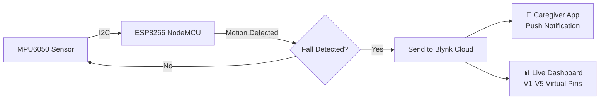
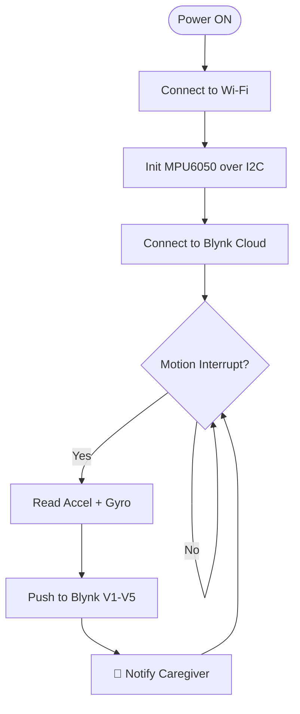

<div align="center">

[](https://git.io/typing-svg)


[](https://www.arduino.cc/)
[](https://blynk.io/)
[](https://opensource.org/licenses/MIT)
[](https://github.com/)

> 🛡️ **An IoT system that detects falls in elderly individuals in real time and instantly notifies caregivers via the Blynk cloud platform.**

</div>

---

## 📌 Overview

The **Elderly Fall Detection System** uses an **ESP8266** microcontroller with an **MPU6050** IMU sensor to continuously monitor motion. When a sudden fall-like movement is detected, it immediately pushes alerts to caregivers through the **Blynk IoT** cloud.

**Why it matters:**
- 1 in 4 elderly people experience a fall each year
- Delayed response significantly worsens outcomes
- This system ensures real-time detection and instant caregiver notification

---

## ✨ Features

- ⚡ Real-time fall detection using accelerometer + gyroscope
- 📡 Wi-Fi cloud connectivity via Blynk IoT
- 📊 Live sensor dashboard (AccelY, AccelZ, GyroX, GyroY, GyroZ)
- 🔔 Instant push notifications to caregiver's phone
- 🧠 Hardware-level motion interrupt for low-power operation
- 🔧 Configurable sensitivity threshold and duration

---

## 🏗️ System Architecture



---

## 🔧 Hardware Components

| # | Component | Purpose | Qty |
|:---:|:---|:---|:---:|
| 1 | ESP8266 NodeMCU | Microcontroller + Wi-Fi | 1 |
| 2 | MPU6050 (GY-521) | Accelerometer + Gyroscope | 1 |
| 3 | Breadboard | Circuit prototyping | 1 |
| 4 | Jumper Wires | Connections | ~10 |
| 5 | USB Micro-A Cable | Programming + Power | 1 |

---

## 🔌 Circuit Connections

| MPU6050 Pin | ESP8266 Pin | Notes |
|:---:|:---:|:---|
| VCC | 3.3V | ⚠️ NOT 5V |
| GND | GND | Common ground |
| SDA | D2 (GPIO4) | I2C Data |
| SCL | D1 (GPIO5) | I2C Clock |
| AD0 | GND | I2C address = 0x68 |

---

## 💻 Software & Libraries

| Library | Purpose |
|:---|:---|
| `ESP8266WiFi.h` | Wi-Fi connectivity |
| `BlynkSimpleEsp8266.h` | Blynk cloud integration |
| `Adafruit_MPU6050.h` | IMU sensor driver |
| `Adafruit_Sensor.h` | Unified sensor abstraction |
| `Wire.h` | I2C protocol |

**Tools:** Arduino IDE 2.x · Blynk App (iOS/Android)

---

## ⚙️ How It Works

1. ESP8266 connects to Wi-Fi and initializes the MPU6050 over I2C
2. MPU6050 is configured with a high-pass filter (0.63 Hz), motion threshold, and 20ms duration
3. A `BlynkTimer` fires `sendSensor()` every **100ms**
4. If a motion interrupt is detected, all 6 sensor axes are read
5. Values are pushed to Blynk virtual pins **V1–V5** in real time
6. Blynk triggers a push notification on the caregiver's phone

### Virtual Pin Mapping

| Pin | Sensor Value | Unit |
|:---:|:---|:---:|
| V1 | AccelY | m/s² |
| V2 | AccelZ | m/s² |
| V3 | GyroX | rad/s |
| V4 | GyroY | rad/s |
| V5 | GyroZ | rad/s |

---

## 🚀 Setup Guide

**1. Install ESP8266 board package in Arduino IDE**
```
https://dl.espressif.com/dl/package_esp32_index.json
```

**2. Install libraries via Library Manager**
```
Blynk · Adafruit MPU6050 · Adafruit Unified Sensor
```

**3. Update credentials in `final_iot.ino`**
```cpp
#define BLYNK_TEMPLATE_ID   "YOUR_TEMPLATE_ID"
#define BLYNK_TEMPLATE_NAME "YOUR_TEMPLATE_NAME"
#define BLYNK_AUTH_TOKEN    "YOUR_AUTH_TOKEN"

char ssid[] = "YOUR_WIFI_SSID";
char pass[] = "YOUR_WIFI_PASSWORD";
```

**4. Select board:** Tools → NodeMCU 1.0 (ESP-12E Module) → Upload

**5. Open Serial Monitor** at 115200 baud to verify connection

---

## 🔄 Workflow



---

## 🚀 Future Enhancements

- 🤖 AI-based fall prediction using TensorFlow Lite
- 📱 Custom mobile app with SOS button
- 🗺️ GPS integration for real-time location on fall events
- ❤️ Heart rate + SpO2 monitoring (MAX30102)
- ☁️ Cloud analytics dashboard

---

## 📁 Folder Structure

```
elderly-fall-detection/
├── src/
│   └── final_iot.ino       # Main source code
├── assets/
│   └── images/             # Circuit & demo photos
├── docs/
│   └── presentation.pptx   # Project presentation
├── README.md
└── LICENSE
```

---

## 👤 Author

<div align="center">

**Your Name**

[](https://linkedin.com/in/your-linkedin)
[](https://github.com/yourusername)
[](mailto:your@email.com)

</div>

---

## 📄 License

This project is licensed under the **MIT License** — see the [LICENSE](LICENSE) file for details.

<div align="center">


*⭐ Star this repo if it helped you!*
</div>
